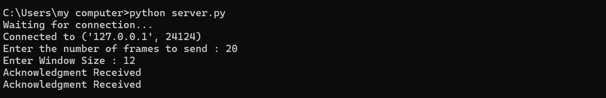
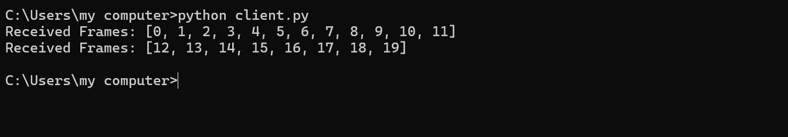

# 2b IMPLEMENTATION OF SLIDING WINDOW PROTOCOL
## AIM
## ALGORITHM:
1. Start the program.
2. Get the frame size from the user
3. To create the frame based on the user request.
4. To send frames to server from the client side.
5. If your frames reach the server it will send ACK signal to client
6. Stop the Program
## PROGRAM

server
```
import socket
s = socket.socket()
s.bind(('localhost', 8002))
s.listen(5)
print("Waiting for connection...")
c, addr = s.accept()
print("Connected to", addr)
ListSize = int(input("Enter the number of frames to send : "))
List = list(range(ListSize))
WindowSize = int(input("Enter Window Size : "))
st = 0
i = 0
while i < ListSize:
    st = i + WindowSize
    frames = List[i:st]
    c.send(str(frames).encode())
    acknowledgment = c.recv(1024).decode()
    if acknowledgment:
        print(acknowledgment)
    i += WindowSize
c.close()
s.close()
```

client 
```
import socket
s = socket.socket()
s.connect(('localhost', 8002))
while True:
    data = s.recv(1024).decode()
    if not data:
        break
    print("Received Frames:", data)
    s.send("Acknowledgment Received".encode())
s.close()
```

## OUPUT




## RESULT
Thus, python program to perform stop and wait protocol was successfully executed
